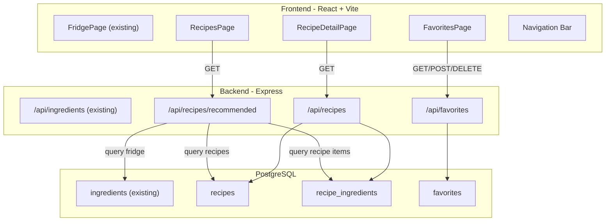

# Recipe + Recommendation System Plan

## Current State

- **Backend:** Express + pg + Zod. One table (`ingredients`), one route module (`[backend/src/routes/ingredients.ts](backend/src/routes/ingredients.ts)`), Zod validation middleware, expiry utils. Entry at `[backend/src/server.ts](backend/src/server.ts)`. Hardcoded `DEFAULT_USER_ID = 1`.
- **Frontend:** React + Vite + Tailwind. No router — single-screen inventory UI in `[frontend/src/App.tsx](frontend/src/App.tsx)`. TanStack Query hooks in `[frontend/src/hooks/useIngredients.ts](frontend/src/hooks/useIngredients.ts)`. Axios client with `/api` proxy to port 3001.
- **DB schema:** Single `ingredients` table defined in `[backend/src/db/schema.sql](backend/src/db/schema.sql)`.

---

## Phase 3 — Recipe Data Model + CRUD

### 3.1 Database Schema

Add three new tables to `[backend/src/db/schema.sql](backend/src/db/schema.sql)`:

```sql
CREATE TABLE IF NOT EXISTS recipes (
  id              SERIAL PRIMARY KEY,
  title           VARCHAR(255) NOT NULL,
  description     TEXT,
  image_url       TEXT,
  cuisine         VARCHAR(100),
  cooking_time    INTEGER,          -- minutes
  servings        INTEGER DEFAULT 2,
  difficulty      VARCHAR(50) DEFAULT 'medium',
  instructions    TEXT,
  created_at      TIMESTAMPTZ NOT NULL DEFAULT NOW(),
  updated_at      TIMESTAMPTZ NOT NULL DEFAULT NOW()
);

CREATE TABLE IF NOT EXISTS recipe_ingredients (
  id              SERIAL PRIMARY KEY,
  recipe_id       INTEGER NOT NULL REFERENCES recipes(id) ON DELETE CASCADE,
  name            VARCHAR(255) NOT NULL,   -- matched against ingredients.name
  quantity        DECIMAL(10,2),
  unit            VARCHAR(50)
);

CREATE TABLE IF NOT EXISTS favorites (
  id              SERIAL PRIMARY KEY,
  user_id         INTEGER NOT NULL DEFAULT 1,
  recipe_id       INTEGER NOT NULL REFERENCES recipes(id) ON DELETE CASCADE,
  created_at      TIMESTAMPTZ NOT NULL DEFAULT NOW(),
  UNIQUE(user_id, recipe_id)
);
```

**Ingredient matching strategy:** Match `recipe_ingredients.name` against the user's `ingredients.name` using case-insensitive comparison (`LOWER()`). This is the simplest approach for a student MVP — no master catalog table needed. If more robust fuzzy matching is wanted later, it can be layered on.

### 3.2 Seed Data

Extend `[backend/src/db/seed.ts](backend/src/db/seed.ts)` to insert 10-15 sample recipes with their ingredients, covering a mix of cuisines and difficulties so the recommendation engine has data to work with.

### 3.3 Backend Types

Create `[backend/src/types/recipe.ts](backend/src/types/recipe.ts)` following the same pattern as `ingredient.ts`:

- `RecipeRow`, `RecipeIngredientRow` — DB row shapes
- `RecipeResponse`, `RecipeDetailResponse` — API response shapes (includes ingredient list)
- `RecipeRecommendation` — extends `RecipeResponse` with match metadata:
  - `match_count`, `total_ingredients`, `missing_count`, `match_ratio`
  - `matched_ingredients: string[]`, `missing_ingredients: string[]`
  - `uses_near_expiry: boolean`, `near_expiry_ingredients: string[]`
  - `explanation: string[]` (array of human-readable reason strings)
- Zod schemas if needed for any create/update endpoints (lower priority)

### 3.4 Backend Routes

Create `[backend/src/routes/recipes.ts](backend/src/routes/recipes.ts)`:

- `GET /api/recipes` — list all recipes (with optional `?cuisine=` filter)
- `GET /api/recipes/:id` — single recipe with its `recipe_ingredients` joined

Create `[backend/src/routes/favorites.ts](backend/src/routes/favorites.ts)`:

- `GET /api/favorites` — list user's favorited recipes
- `POST /api/favorites/:recipeId` — add favorite
- `DELETE /api/favorites/:recipeId` — remove favorite

Register both in `[backend/src/server.ts](backend/src/server.ts)`:

```typescript
app.use("/api/recipes", recipesRouter);
app.use("/api/favorites", favoritesRouter);
```

### 3.5 Frontend — Add Routing

Install `react-router-dom`. Refactor `[frontend/src/App.tsx](frontend/src/App.tsx)` from a single-view component into a router with pages:

- `/` or `/fridge` — existing inventory UI (extract into `src/pages/FridgePage.tsx`)
- `/recipes` — recipe list + recommendations
- `/recipes/:id` — recipe detail
- `/favorites` — saved recipes

Add a persistent navigation bar (tab bar or sidebar) to `[frontend/src/components/Layout.tsx](frontend/src/components/Layout.tsx)`.

### 3.6 Frontend — Recipe Types + API

- `[frontend/src/types/recipe.ts](frontend/src/types/recipe.ts)` — mirrors backend response types
- `[frontend/src/api/recipes.ts](frontend/src/api/recipes.ts)` — `fetchRecipes`, `fetchRecipe`, `fetchRecommendations`
- `[frontend/src/api/favorites.ts](frontend/src/api/favorites.ts)` — `fetchFavorites`, `addFavorite`, `removeFavorite`
- `[frontend/src/hooks/useRecipes.ts](frontend/src/hooks/useRecipes.ts)` — TanStack Query wrappers

### 3.7 Frontend — Recipe Pages

- **RecipesPage:** Grid of recipe cards showing title, cuisine, cooking time, image, and (once Phase 4 is done) match indicators
- **RecipeDetailPage:** Full recipe with ingredients list (highlighting which ones the user already has), instructions, and a favorite button
- **FavoritesPage:** Saved recipe list

---

## Phase 4 — Recommendation Engine

### 4.1 Recommendation Endpoint

`GET /api/recipes/recommended` in `[backend/src/routes/recipes.ts](backend/src/routes/recipes.ts)`.

**Algorithm (single SQL query + JS post-processing):**

1. Fetch all recipes with their `recipe_ingredients` (one query with JOIN)
2. Fetch user's current fridge ingredients (one query, `user_id = 1`)
3. For each recipe, compute in JS:
  - `matched` = recipe ingredients whose `LOWER(name)` exists in fridge
  - `missing` = recipe ingredients not in fridge
  - `match_ratio` = `matched.length / total_ingredients`
  - `uses_near_expiry` = any matched ingredient is near-expiry in fridge
  - `near_expiry_ingredients` = names of those ingredients
4. Filter: only include recipes with `match_ratio > 0` (user has at least one ingredient)
5. Sort by: `uses_near_expiry DESC`, then `match_ratio DESC`, then `missing_count ASC`
6. Generate explanation strings per recipe:
  - "You have 5 of 6 required ingredients"
  - "Uses near-expiry tomatoes and eggs"
  - "Only missing: butter"

### 4.2 Recommendation Response Shape

```typescript
{
  recipe: RecipeResponse,
  match_count: number,
  total_ingredients: number,
  missing_count: number,
  match_ratio: number,           // 0.0 – 1.0
  matched_ingredients: string[],
  missing_ingredients: string[],
  uses_near_expiry: boolean,
  near_expiry_ingredients: string[],
  explanation: string[]          // human-readable reason lines
}
```

### 4.3 Frontend — Recommendation UI

On the `/recipes` page (or a dedicated `/recommendations` tab):

- Show recommended recipes sorted by match quality
- Each card displays:
  - Match ratio bar or badge ("5/6 ingredients")
  - Near-expiry usage callout (highlighted if applicable)
  - Missing ingredients listed
  - Explanation text
- Filter/sort controls: by match ratio, by cooking time, by cuisine

---

## Architecture Overview




---

## Implementation Order

The work is ordered to always have a working, testable system at each step. Backend schema and seed come first so APIs can be tested with curl before any frontend work begins.